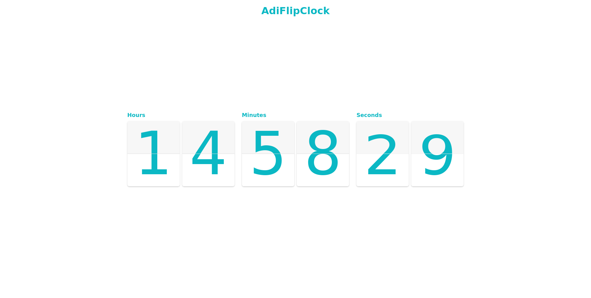
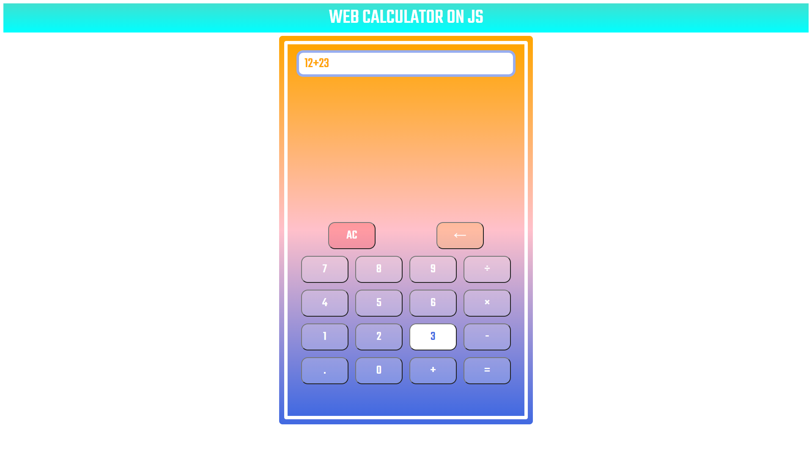

# Awesome_Web_Designs

### This project contains projects which are created with using HTML CSS JS

> ## [00-Car_Animation](https://adithyana2005.github.io/Awesome_Web_Apps/00-Car_Animation/index.html)
>
> This is a car animation made by using pure css and js
> 

> ## [01-Twist_Text_Animation](https://adithyana2005.github.io/Awesome_Web_Apps/01-Twist_Text_Animation/index.html)
>
> This is a 3D Text animation
> 

> ## [02-Raining_Cloud_Animation](https://adithyana2005.github.io/Awesome_Web_Apps/02-Raining_Cloud_Animation/index.html)
>
> This is a Raining Cloud Animation
> 

> ## [03-Web_Clock](https://adithyana2005.github.io/Awesome_Web_Apps/03-Web_Clock/index.html)
>
> This is a web clock made by using pure HTML CSS &JS
> 

> ## [04-Flip_Clock](https://adithyana2005.github.io/Awesome_Web_Apps/04-Flip_Clock/index.html)
>
> This is a clock with a fliping design. Created by using pure HTML CSS JSS
> 

> ## [05-Web_Calculator](https://adithyana2005.github.io/Awesome_Web_Apps/05-Web_Calculator/index.html)
>
> This is a web based calculator developed using HTML, SCSS and JS
> 

> ## [06-Facebook_Login_Page](https://adithyana2005.github.io/Awesome_Web_Apps/06-Facebook_Login_Page/index.html)
>
> This is a clone of the Facebook login page Please note the latest version of Facebook login page is diffrent from this one Since this is a old version of it
> 

> ## [07-Instagram_Login_Page](https://adithyana2005.github.io/Awesome_Web_Apps/07-Instagram_Login_Page/index.html)
>
> This is a clone of the Instagram login page
> 

> ## [08-LinkedIn_Login_Page](https://adithyana2005.github.io/Awesome_Web_Apps/08-LinkedIn_Login_Page/index.html)
>
> This is a clone of the Instagram login page
> 
